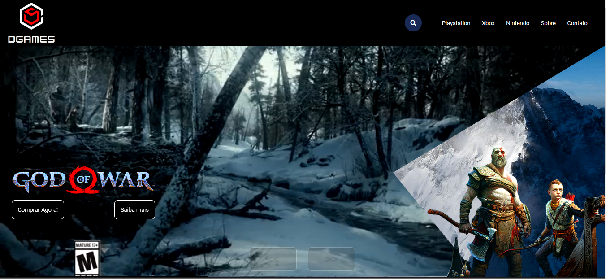
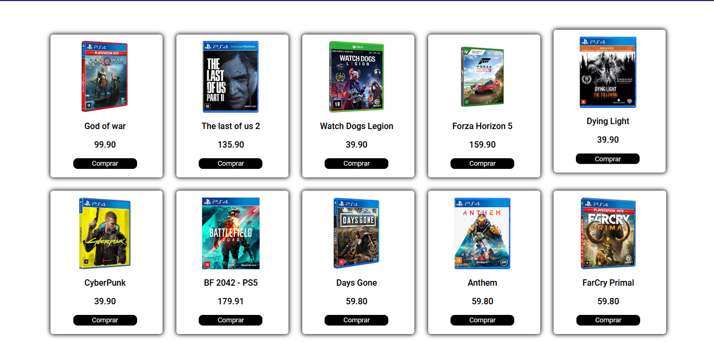
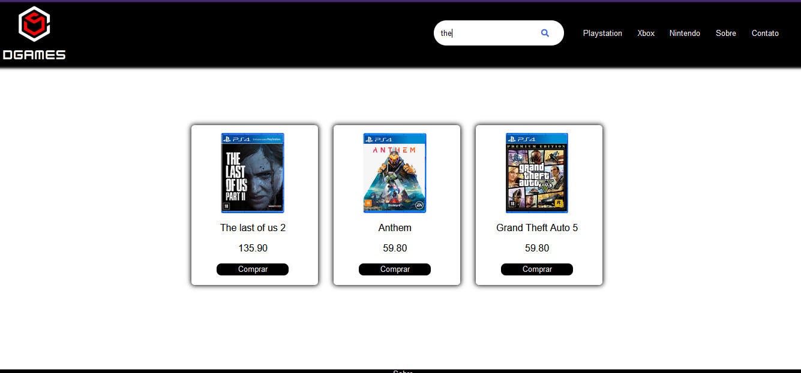
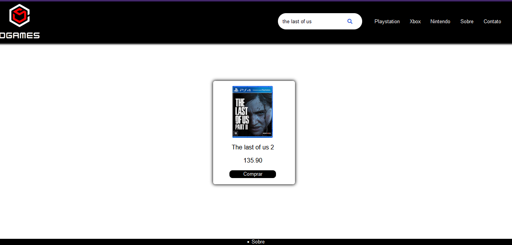

## Frontend Games Store

### This is the frontend of the Game Store project

The technologies used are:

-   HTML
-   CSS
-   JavaScript

The back end of the project can be found at: [link project](https://github.com/leovd100/Game-Store---Back-end-Java-Spring-boot-)

The main project is in the pages folder

-   index.html

---

